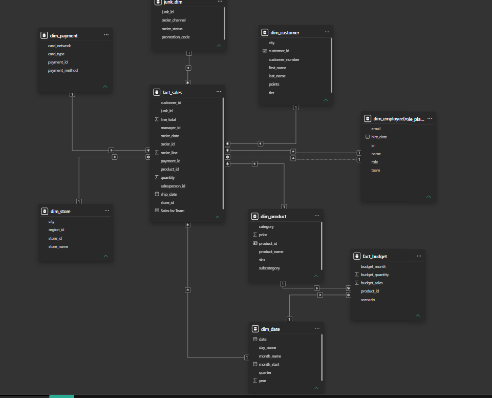

# Power BI Sales Data Model

> **Portfolio Stage 4 — Power BI Data Modelling | Dimensional Modelling | Relationships | DAX**

This project represents the next stage in my analytics development: moving beyond spreadsheet-based reporting into **Power BI data modelling**.

The focus of this project is the underlying model structure rather than only the final report layer. I designed a dimensional model around sales and budget data, using fact and dimension tables, relationship design, a dedicated date dimension, a role-playing employee dimension and a junk dimension.

## Project Objective

The aim was to build a reusable analytical model that can support reporting across sales, customers, products, stores, employees, payments, dates and budgets.

Rather than placing all fields in a single flat table, I structured the model so descriptive attributes are separated into dimensions and transactional measures remain in fact tables.

## Model Architecture

### Fact Tables

- **`fact_sales`** — central transactional sales table
- **`fact_budget`** — budget values by product, period and scenario

### Dimension Tables

- **`dim_customer`** — customer attributes
- **`dim_product`** — product, category and pricing attributes
- **`dim_store`** — store and location information
- **`dim_payment`** — payment-related attributes
- **`dim_date`** — reusable calendar dimension
- **`dim_employee (role_playing dim)`** — employee attributes used across multiple business roles
- **`junk_dim`** — low-cardinality transactional attributes such as order channel, order status and promotion code

## Key Modelling Concepts Demonstrated

### Dimensional modelling

The model separates transactional data from descriptive attributes using fact and dimension tables. This provides a clearer structure for analysis and reduces duplication compared with a single flat reporting table.

### One-to-many relationships

The model uses dimension-to-fact relationships so descriptive tables sit on the **one** side and transactional records sit on the **many** side.

### Role-playing dimension

The employee dimension is reused for more than one employee-related role in the sales process. This demonstrates the role-playing dimension concept rather than duplicating essentially the same employee data.

### Date dimension

A dedicated date table supports consistent time-based analysis using fields including date, day name, month name, month start, quarter and year.

### Junk dimension

The model groups several low-cardinality transactional descriptors into a dedicated `junk_dim`, keeping the main sales fact table more focused on keys and measures.

### Multiple fact tables

Using both `fact_sales` and `fact_budget` allows the model to support actual sales analysis alongside budget or scenario-based analysis.

## DAX

The model also includes a DAX measure:

- **Sales by Team**

This was introduced to begin moving beyond model structure into reusable analytical measures.

## Skills Demonstrated

- Microsoft Power BI
- Data modelling
- Dimensional modelling
- Fact and dimension table design
- Star-schema concepts
- Relationship design
- One-to-many cardinality
- Role-playing dimensions
- Date dimensions
- Junk dimensions
- Multiple fact tables
- DAX measures
- Analytical model design

## Files

| File | Purpose |
|---|---|
| **[First Data Model.pbix](First%20Data%20Model.pbix)** | Original Power BI project |
| **[power-bi-data-model.png](assets/power-bi-data-model.png)** | Original Power BI Model view screenshot |
| **[MODEL-DOCUMENTATION.md](docs/MODEL-DOCUMENTATION.md)** | Model structure and table descriptions |

## Portfolio Progression

This project follows my earlier Excel portfolio work:

**[Stage 1 — Healthcare Patient Risk Analysis](https://github.com/RxAnalyst-Aisosa/Healthcare-Patient-Risk-Analysis-Dashboard)**  
→ **[Stage 2 — Coffee Sales Analysis](https://github.com/RxAnalyst-Aisosa/Coffee-Sales-Analysis-Excel-Portfolio-Project)**  
→ **[Stage 3 — Excel Sales Analysis Dashboard](https://github.com/RxAnalyst-Aisosa/Excel-Sales-Analysis-Dashboard)**  
→ **Stage 4 — Power BI Data Modelling: this project**

The progression is intentional. My earlier projects focused on Excel analysis and dashboarding; this project moves further into the **data-model layer that supports business intelligence reporting**.

## Development Direction

I am continuing to build deeper capability across **Power BI, SQL, DAX, Python/R and AI-enabled automation**, with each new project designed to introduce a new analytical or technical skill rather than simply repeat the same workflow.

---

**Aisosa Elizabeth Erhunmwunsee**  
*Pharmacy | Business Analytics | Data Analysis | Business Intelligence*
